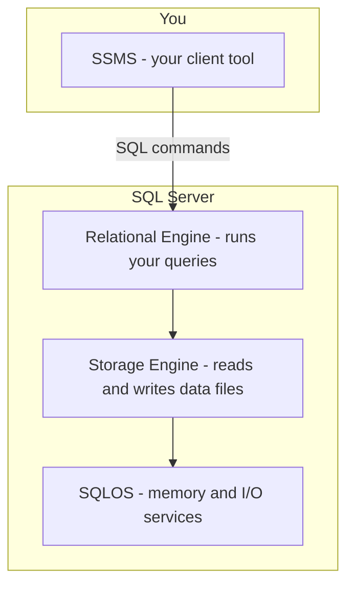
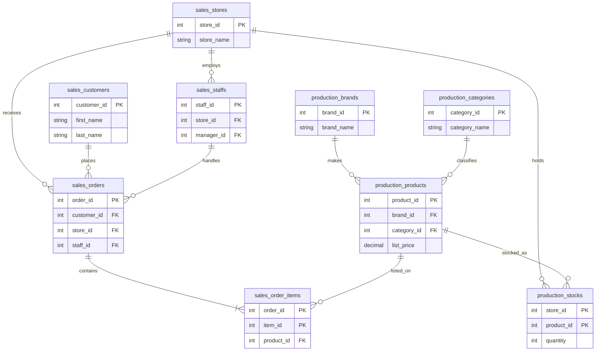

# Chapter 01 - Environment Setup


Get SQL Server running on your computer, connect with SQL Server Management Studio (SSMS), and load the **BikeStores** practice database you will use in every chapter of this book.

## Prerequisites

- A Windows PC with administrator rights (to install software)
- At least 6 GB of free disk space
- An internet connection for downloads
- No prior SQL experience required

## Learning goals

After this chapter, you will be able to:

- **Explain** what SQL Server is and how it stores data in tables
- **Install** SQL Server 2022 Developer Edition and SSMS on your computer
- **Connect** to your local server and run your first query
- **Describe** the BikeStores database structure (schemas, tables, relationships)
- **Load** the BikeStores sample database using the provided scripts


## Time estimate

- **Reading:** about 45–60 minutes
- **Hands-on setup:** about 30–45 minutes (downloads and install vary by machine)

## What you'll need

| Item | Location |
|------|----------|
| SQL Server 2022 Developer Edition | [Microsoft download](https://www.microsoft.com/en-us/sql-server/sql-server-downloads) |
| SSMS | [Microsoft download](https://learn.microsoft.com/en-us/sql/ssms/download-sql-server-management-studio-ssms) |
| BikeStores create script | [`assets/database/01-create-objects.sql`](assets/database/01-create-objects.sql) |
| BikeStores data script | [`assets/database/02-load-data.sql`](assets/database/02-load-data.sql) |
| Reset script (optional) | [`assets/database/03-drop-objects.sql`](assets/database/03-drop-objects.sql) |

**Environment:** SQL Server 2022 Developer Edition, SSMS, database name **BikeStores**.

## Troubleshooting

| Problem | What to try |
|---------|-------------|
| Cannot connect to `localhost` | Start the **SQL Server (MSSQLSERVER)** service in Windows **Services** |
| Login failed for `sa` | Confirm Mixed Mode was enabled during install; check password |
| `CREATE DATABASE` permission denied | Use the `sa` login or ask your lab instructor for rights |
| Script errors on re-run | Run `01-create-objects.sql` (recreates tables), then `02-load-data.sql` again |
| Tables empty after scripts | Confirm you ran **both** create and load scripts against `BikeStores` |


---

## What is SQL Server?

### Why this matters

Before you install anything, it helps to know what you are setting up. SQL Server is the software that will store your practice data and run the queries you write. Every example in this book uses the same sample database on your own machine — so you can experiment safely without breaking a real production system.

### Concept

#### What is a database?

A **database** is an organized place to store data so you can search, update, and report on it later. Think of a spreadsheet workbook, but designed for much larger amounts of data and many users at once.

#### What is SQL Server?

**SQL Server** is a **relational database management system (RDBMS)** made by Microsoft. In plain terms, it is software that:

1. Stores data in **tables** (rows and columns)
2. Lets you ask questions using **Structured Query Language (SQL)**
3. Keeps data consistent and secure

You send SQL commands to SQL Server; it figures out how to read or change the data and returns results.

#### SQL and T-SQL

**SQL** is the standard language for working with relational databases. Microsoft’s version is called **Transact-SQL (T-SQL)**. It includes everything in standard SQL plus extra features for SQL Server. In this book, when we say “write a query,” we mean T-SQL unless noted otherwise.

#### How SQL Server is organized (big picture)

You do not need to memorize every internal part. A simple mental model is enough for now:



| Part | What it does (simply) |
|------|------------------------|
| **SSMS** | The app you use to connect, write SQL, and view results |
| **Relational Engine** | Receives your query, plans the best way to run it, returns results |
| **Storage Engine** | Stores tables on disk and fetches the rows you need |
| **SQLOS** | Low-level services (memory, threads) that keep SQL Server running smoothly |

You will learn more about indexes, execution plans, and stored procedures in later chapters. For now, remember: **you write SQL in SSMS → SQL Server processes it → you get results.**

#### Which edition should you install?

For learning, use **SQL Server 2022 Developer Edition**. It is **free** and includes the same features as Enterprise Edition, but it is licensed only for development and testing — not for production websites or live business systems.

| Edition | Good for learners? | Notes |
|---------|-------------------|--------|
| **Developer** | Yes — use this | Full features, free for practice |
| **Express** | Possible | Free, but smaller limits (e.g. database size cap) |
| **Standard / Enterprise** | No | Paid; for production environments |

> **Note:** SQL Server also runs on Linux today. This book uses **Windows** and **SSMS**, which is the most common setup in classrooms and tutorials.

#### Other Microsoft tools (optional for now)

SQL Server comes with many tools for large companies — reporting, data integration, analytics. You do **not** need them to complete this book. The only tool required here is **SSMS** to connect and run queries.

### Syntax

You are not running SQL in this lesson yet. Here is what a typical command looks like so the shape feels familiar:

```sql
SELECT @@VERSION;
```

- `SELECT` — ask the server to return something
- `@@VERSION` — a built-in function that returns your SQL Server version text

You will run this in [Lesson 02](#lesson-02) after installation.

### Walkthrough

Imagine a bike shop chain called **BikeStores** (your practice database):

- **Customers** place **orders**
- Each order has **line items** (products and quantities)
- **Products** belong to **brands** and **categories**
- **Staff** work at **stores** and record sales

That is a relational database: related tables linked by keys (for example, each order points to one customer). The rest of this book uses BikeStores so every example feels connected.

### How it works

When you eventually run `SELECT @@VERSION`, SQL Server receives the text, the relational engine parses it, and the result is sent back to SSMS as a small result grid. No tables are involved for that particular query — it is just asking the server about itself.

### Common mistakes

- **Confusing SQL Server with SSMS** — SQL Server is the database engine (service running on your PC). SSMS is the window you type into. You need both.
- **Installing Express when you meant Developer** — Developer is better for learning because it does not cap features you will use later.
- **Expecting a visible “app” after install** — SQL Server runs as a **background service**. You interact with it through SSMS.

### Quick recap

- SQL Server stores data in tables and answers questions written in SQL (T-SQL).
- SSMS is your client tool for connecting and running queries.
- Developer Edition is the right free choice for this course.
- BikeStores is the sample bike-shop database used throughout the book.

### Next

[Install SQL Server and connect with SSMS](#install-sql-server-and-connect-with-ssms)


---

## Install SQL Server and Connect with SSMS

### Why this matters

Reading about databases is not enough — you need a running SQL Server on your machine and a way to talk to it. This lesson walks you through installation and your first successful connection. Once you see a result in SSMS, the rest of the course becomes hands-on.

### Concept

#### Two pieces of software

| Software | Role |
|----------|------|
| **SQL Server 2022 Developer Edition** | The database engine (runs as a Windows service) |
| **SQL Server Management Studio (SSMS)** | The graphical tool where you connect, write SQL, and view data |

Install SQL Server first, then SSMS.

#### Instance name

During setup you create an **instance** — a named copy of SQL Server on your computer. The default instance is often called `MSSQLSERVER`. When you connect locally, you typically use the server name **`localhost`** or **`.`** (a dot).

#### Authentication

SQL Server can verify who you are in different ways. For this course we use **Mixed Mode**, which allows:

- **Windows Authentication** — uses your Windows login
- **SQL Server Authentication** — uses a SQL login name and password (we create the `sa` login during install)

You will connect with the **`sa`** account and the password you choose during installation. Store that password safely.

> **Tip:** If you clicked **Add Current User** during install, you can also connect with **Windows Authentication** and your Windows login — no `sa` password required. This book uses **`sa`** so steps stay the same on every machine.

### Syntax

Connection settings you will enter in SSMS:

| Field | Value |
|-------|-------|
| Server type | Database Engine |
| Server name | `localhost` |
| Authentication | SQL Server Authentication |
| Login | `sa` |
| Password | *(password you set during install)* |

Your first query after connecting:

```sql
SELECT @@VERSION;
```

### Walkthrough

#### Part A — Download and install SQL Server 2022 Developer Edition

1. Go to the [SQL Server downloads page](https://www.microsoft.com/en-us/sql-server/sql-server-downloads).
2. Under **Developer**, choose **Download now**.
3. When asked for installation type, choose **Download Media** so you can run the installer from a folder on your PC.
4. Pick a download location and wait for the download to finish.
5. Open the downloaded folder and run **`SQLServer2022-DEV-x64-ENU`** (or similar) to extract files and start setup.
6. In **SQL Server Installation Center**, click **Installation** in the left pane.
7. Choose **Developer** edition and click **Next** through the license screen.
8. On **Microsoft Update**, you may uncheck updates if you prefer; click **Next**.
9. Wait for **Install Rules** to pass, then click **Next**.
10. On **Azure Extension for SQL Server**, **uncheck** the extension unless you specifically need it.
11. On **Feature Selection**, enable **Database Engine Services** (that is enough for this book). Click **Next**.
12. On **Instance Configuration**, keep the default instance name unless you have a reason to change it. Click **Next**.
13. On **Service Accounts**, accept defaults. Click **Next**.
14. On **Database Engine Configuration** → **Security**:
    - Select **Mixed Mode**
    - Enter and confirm a strong password for the **`sa`** account
    - Click **Add Current User** so your Windows account is also an administrator
15. Complete remaining screens with defaults and click **Install**.
16. When setup finishes, click **Close**.

> **Note:** Installer screens and button labels may look slightly different in newer builds. Match the options described here (Developer edition, Database Engine Services, Mixed Mode).

> **Tip:** Write down your `sa` password in a password manager or secure note. You will need it every time you connect with SQL Server Authentication.

#### Part B — Install SSMS

1. Download [SSMS](https://learn.microsoft.com/en-us/sql/ssms/download-sql-server-management-studio-ssms).
2. Run the installer and click **Install**.
3. When finished, click **Close**. SSMS is installed separately from the database engine.

#### Part C — Connect in SSMS

1. Open **Microsoft SQL Server Management Studio**.
2. In the **Connect to Server** dialog:
   - Server type: **Database Engine**
   - Server name: **`localhost`**
   - Authentication: **SQL Server Authentication**
   - Login: **`sa`**
   - Password: your `sa` password
3. Optionally check **Remember password**.
4. Click **Connect**.

If connection succeeds, the **Object Explorer** panel on the left shows your server name and folders such as **Databases**.

#### Part D — Run your first query

1. In Object Explorer, right-click the server name → **New Query**.
2. Type in the query editor:

```sql
SELECT @@VERSION;
```

3. Click **Execute** (toolbar) or press **F5**.

#### Expected result

A single row with a long text value describing your SQL Server version, edition, and build number. For example, it may include `Microsoft SQL Server 2022` and `Developer Edition`.

### How it works

SSMS sends your SQL text to the SQL Server service over a network protocol (even on `localhost`). The relational engine runs the command and returns a **result set** — here, one row, one column. The `@@VERSION` function is built into SQL Server; it does not read from a table you created.

### Another example

List the databases that already exist on your server:

```sql
SELECT name
FROM sys.databases
ORDER BY name;
```

You should see system databases such as `master`, `model`, `msdb`, and `tempdb`. **BikeStores** is not there yet — you will create it in [Lesson 04](#lesson-04).

### Common mistakes

- **“Cannot connect to localhost”** — SQL Server service may not be running. Open **Services** in Windows, find **SQL Server (MSSQLSERVER)** or your instance name, and start it.
- **Login failed for user 'sa'** — Wrong password, or Mixed Mode was not enabled during install. You may need to reinstall or enable Mixed Mode in server properties (ask your instructor if stuck).
- **Wrong server name** — Try `(local)` or `.\SQLEXPRESS` only if you installed a **named instance** called SQLEXPRESS. Default Developer install uses `localhost`.
- **Running `SELECT` before connecting** — The query editor must be connected to a server (check the status bar at the bottom of SSMS).

### Quick recap

- Install **SQL Server Developer Edition** (Database Engine) then **SSMS**.
- Use **Mixed Mode** and set an **`sa`** password during install.
- Connect with server name **`localhost`**, login **`sa`**, and your password.
- Run `SELECT @@VERSION;` to confirm everything works.

### Next

[Meet the BikeStores database](#meet-the-bikestores-database)


---

## Meet the BikeStores Database

### Why this matters

Every query in this book runs against the same sample database. If you understand how BikeStores is organized — which tables exist and how they relate — later lessons on `JOIN`, `GROUP BY`, and reports will feel natural instead of memorized.

### Concept

#### What is BikeStores?

**BikeStores** is a fictional chain of bike shops. The database models:

- Who **buys** (customers)
- What **sells** (products, brands, categories)
- Where **sales happen** (stores, staff)
- **Orders** and **line items**
- **Stock** levels per store

#### Database, schema, and table

| Term | Meaning | BikeStores example |
|------|---------|-------------------|
| **Database** | A container for all related objects | `BikeStores` |
| **Schema** | A folder-like group inside a database | `sales`, `production` |
| **Table** | Rows and columns of data | `sales.customers` |

Full table names use the form **`schema_name.table_name`**, for example `production.products`.

#### Two schemas

The diagram below uses underscores instead of dots in names (for example, `sales_stores` means the `stores` table in the `sales` schema). In SQL, always write `sales.stores`.



##### `sales` schema — people and transactions

| Table | Stores |
|-------|--------|
| `sales.stores` | Store names, addresses, contact info |
| `sales.staffs` | Employees; each staff member works at one store; `manager_id` links to another staff row |
| `sales.customers` | Customer names, email, phone, address |
| `sales.orders` | Order header: customer, store, staff, dates, status |
| `sales.order_items` | Each product line on an order: quantity, price, discount |

##### `production` schema — catalog and inventory

| Table | Stores |
|-------|--------|
| `production.categories` | Types of bikes (e.g. mountain, electric) |
| `production.brands` | Manufacturers (e.g. Electra, Haro) |
| `production.products` | Product name, brand, category, model year, list price |
| `production.stocks` | How many of each product each store has on hand |

**Total:** 9 tables, 2 schemas.

#### Keys and relationships (beginner view)

- **Primary key (PK):** Column that uniquely identifies each row (e.g. `customer_id`).
- **Foreign key (FK):** Column that points to a row in another table (e.g. `sales.orders.customer_id` → `sales.customers.customer_id`).

You do not need to design databases yet — just recognize that **`sales.orders` links customers to products through `sales.order_items`**.

#### Order status codes

In `sales.orders`, the `order_status` column uses numbers:

| Value | Meaning |
|-------|---------|
| 1 | Pending |
| 2 | Processing |
| 3 | Rejected |
| 4 | Completed |

### Syntax

How to refer to a table in SQL (preview — you will use this heavily from Chapter 02 onward):

```sql
SELECT *
FROM sales.customers;
```

- `sales` — schema name
- `customers` — table name

### Walkthrough

Walk through the business story once:

1. A **customer** places an **order** at a **store**.
2. A **staff** member records the order.
3. The order has one or more **order items**; each item references a **product**.
4. Each **product** has a **brand** and **category**.
5. **Stocks** shows how many units of each product sit in each store.

When you load data in the next lesson, you can verify row counts. For now, skim one table definition from the create script — `sales.customers`. You do not need to memorize this syntax yet; it shows how columns and keys are declared.

```sql
CREATE TABLE sales.customers (
    customer_id INT IDENTITY(1, 1) PRIMARY KEY,
    first_name  VARCHAR(255) NOT NULL,
    last_name   VARCHAR(255) NOT NULL,
    phone       VARCHAR(25),
    email       VARCHAR(255) NOT NULL,
    street      VARCHAR(255),
    city        VARCHAR(50),
    state       VARCHAR(25),
    zip_code    VARCHAR(5)
);
```

- `IDENTITY(1,1)` — SQL Server auto-generates `customer_id` values (1, 2, 3, …).
- `PRIMARY KEY` — each `customer_id` is unique.
- `NOT NULL` — that column must have a value.

The full script for all nine tables is in [`assets/database/01-create-objects.sql`](assets/database/01-create-objects.sql).

### How it works

Schemas keep related tables grouped. The `sales` schema holds transactional data; `production` holds the product catalog. Foreign keys enforce sensible links — you cannot add an order item for a product id that does not exist.

### Common mistakes

- **Forgetting the schema** — `SELECT * FROM customers` fails on BikeStores. Use `sales.customers`.
- **Confusing orders with order items** — One order has many line items. Header vs detail is a common pattern in real databases.
- **Expecting data before loading** — After Lesson 04, tables will contain rows. Empty tables before load are normal.

### Quick recap

- BikeStores has **9 tables** in **`sales`** and **`production`** schemas.
- **Sales** = customers, orders, staff, stores. **Production** = products, brands, categories, stock.
- Tables connect via **primary** and **foreign** keys.
- Always use `schema.table` when querying.

### Next

[Load the BikeStores sample data](#load-the-bikestores-sample-data)


---

## Load the BikeStores Sample Data

### Why this matters

An empty database is like a shop with shelves but no products. Loading sample data gives you real rows to query, filter, and summarize in the next chapters. You only need to do this once (or again after a reset if you want a clean copy).

### Concept

#### What you will do

1. Create a new database named **`BikeStores`**
2. Run a script that creates **schemas** and **tables**
3. Run a second script that **inserts** practice data

The scripts live in this book’s repository so you do not need a separate download.

#### Script files

| File | Purpose |
|------|---------|
| [`01-create-objects.sql`](assets/database/01-create-objects.sql) | Creates schemas and all 9 tables |
| [`02-load-data.sql`](assets/database/02-load-data.sql) | Inserts sample rows |
| [`03-drop-objects.sql`](assets/database/03-drop-objects.sql) | Removes tables (optional reset) |

#### Order matters

Always run **create** before **load**. The create script can be re-run safely — it drops and recreates tables. The load script clears existing rows before inserting, so you can re-run it too.

If you want a full reset, run [`03-drop-objects.sql`](assets/database/03-drop-objects.sql), then create and load again.

### Syntax

Create the database (run once; skip if `BikeStores` already exists):

```sql
IF NOT EXISTS (
    SELECT name FROM sys.databases WHERE name = N'BikeStores'
)
    CREATE DATABASE BikeStores;
```

Switch context to that database before running the table scripts:

```sql
USE BikeStores;
```

After loading, a quick check:

```sql
SELECT COUNT(*) AS customer_count
FROM sales.customers;
```

### Walkthrough

#### Step 1 — Connect in SSMS

Use the same connection from [Lesson 02](#lesson-02) (`localhost`, `sa`).

#### Step 2 — Create the BikeStores database

1. Right-click the server in Object Explorer → **New Query**.
2. Run:

```sql
IF NOT EXISTS (
    SELECT name FROM sys.databases WHERE name = N'BikeStores'
)
    CREATE DATABASE BikeStores;
```

3. If you see a message that the database already exists, that is fine — continue to Step 3.

#### Step 3 — Run the create-objects script

1. Menu **File** → **Open** → **File**.
2. Open [`01-create-objects.sql`](assets/database/01-create-objects.sql) from this repository.
3. Confirm the script includes `USE BikeStores;` at the top.
4. Click **Execute** (or **F5**).
5. Messages should show commands completed successfully.

#### Step 4 — Verify tables in Object Explorer

1. Right-click **Databases** → **Refresh**.
2. Expand **BikeStores** → **Tables**.
3. You should see tables under **`sales`** and **`production`** (nine tables total).

#### Step 5 — Run the load-data script

1. **File** → **Open** → **File** → [`02-load-data.sql`](assets/database/02-load-data.sql).
2. Click **Execute**.
3. Wait for completion — insert scripts can take a few seconds.

#### Step 6 — Confirm data loaded

Run:

```sql
USE BikeStores;

SELECT COUNT(*) AS customer_count
FROM sales.customers;

SELECT COUNT(*) AS product_count
FROM production.products;
```

#### Expected result

With the bundled sample data you should see:

| Check | Expected value |
|-------|----------------|
| `customer_count` | **10** |
| `product_count` | **15** |

Also try browsing data:

```sql
SELECT TOP 5
    product_name,
    list_price
FROM production.products
ORDER BY list_price DESC;
```

You should see five product rows with prices.

### How it works

The create script defines structure (columns, keys, relationships). The load script runs `INSERT` statements to fill tables. SQL Server checks foreign keys as rows arrive — for example, an order item cannot reference a product id that does not exist.

### Another example — join preview

This combines two tables you will study in [Chapter 03: Joins](Chapter 03 - Joins.md):

```sql
SELECT TOP 5
    p.product_name,
    b.brand_name
FROM production.products AS p
INNER JOIN production.brands AS b
    ON b.brand_id = p.brand_id;
```

If this returns product names with brand names, your database is ready for the rest of the course.

### Common mistakes

- **Running load before create** — Tables must exist first.
- **Re-running only the load script after changing data** — The load script clears tables first, but always run create before load on a fresh setup.
- **Wrong database selected** — Check the database dropdown in SSMS or run `USE BikeStores;` before scripts.
- **Partial script highlighted** — Only the selected text runs. For a full script, select nothing (or select all) before Execute.
- **Permission errors** — The `sa` login should have full rights. If using a school lab account, ask whether you are allowed to create databases.

> **Warning:** The load script adds data. The drop script in `03-drop-objects.sql` removes tables — use only when you intend to reset practice data.

### Quick recap

- Create database `BikeStores`, then run `01-create-objects.sql`, then `02-load-data.sql`.
- Refresh Object Explorer to see nine tables.
- Use `COUNT(*)` to verify rows exist.
- You are now ready to write queries in Chapter 02.

### Next

Complete the [Exercises](#exercises), then continue to [Chapter 02: SELECT and Filter](Chapter 02 - Querying and Filtering.md).


---

## Exercises


Complete these after working through the topics above. Use SSMS and the **BikeStores** database unless noted.

---

#### Exercise 1 — Server version (warm-up)

Run a query that returns the SQL Server version string.

**Tables:** none (server function)

---

#### Exercise 2 — List user tables (warm-up)

List the names of all **user tables** in the BikeStores database (tables you created, not system tables).

**Tables:** catalog views  
**Hint:** Query `INFORMATION_SCHEMA.TABLES`, filter by `TABLE_TYPE = 'BASE TABLE'` and `TABLE_SCHEMA IN ('sales', 'production')`. Include `TABLE_SCHEMA` and `TABLE_NAME`.

---

#### Exercise 3 — Explore a table structure

Show column names and data types for `sales.customers`.

**Tables:** `sales.customers`  
**Hint:** Use `INFORMATION_SCHEMA.COLUMNS` or run `sp_help 'sales.customers';` in SSMS.

---

#### Exercise 4 — Count customers (apply)

How many customers are in the database?

**Tables:** `sales.customers`

---

#### Exercise 5 — Top-priced products (apply)

Show the **five** most expensive products: product name and list price, highest first.

**Tables:** `production.products`

---

#### Exercise 6 — Orders by status ★ (stretch)

Count how many orders exist for each `order_status` value. Show the status number and the count.

**Tables:** `sales.orders`  
**Hint:** You will learn `GROUP BY` in [Chapter 04: Grouping and Aggregation](Chapter 04 - Grouping and Aggregation.md). For now, try `GROUP BY order_status` with `COUNT(*)`.

---

#### Exercise 7 — Business story check ★ (stretch)

Write a query that returns one row per order with:

- `order_id`
- customer first and last name
- store name

**Tables:** `sales.orders`, `sales.customers`, `sales.stores`  
**Hint:** You will formalize this in [Chapter 03: Joins](Chapter 03 - Joins.md). Join `sales.orders` to `sales.customers` on `customer_id` and to `sales.stores` on `store_id`.


---

## Solutions


---

#### Exercise 1 — Solution

```sql
SELECT @@VERSION;
```

Returns one row with the full SQL Server version and edition text.

---

#### Exercise 2 — Solution

```sql
USE BikeStores;

SELECT
    TABLE_SCHEMA,
    TABLE_NAME
FROM
    INFORMATION_SCHEMA.TABLES
WHERE
    TABLE_TYPE = 'BASE TABLE'
    AND TABLE_SCHEMA IN ('sales', 'production')
ORDER BY
    TABLE_SCHEMA,
    TABLE_NAME;
```

Returns nine rows — tables under the `production` and `sales` schemas.

---

#### Exercise 3 — Solution

Option A — catalog query:

```sql
USE BikeStores;

SELECT
    COLUMN_NAME,
    DATA_TYPE,
    IS_NULLABLE
FROM
    INFORMATION_SCHEMA.COLUMNS
WHERE
    TABLE_SCHEMA = 'sales'
    AND TABLE_NAME = 'customers'
ORDER BY
    ORDINAL_POSITION;
```

Option B — stored procedure:

```sql
EXEC sp_help 'sales.customers';
```

Returns column definitions including `customer_id`, `first_name`, `last_name`, and others.

---

#### Exercise 4 — Solution

```sql
USE BikeStores;

SELECT COUNT(*) AS customer_count
FROM sales.customers;
```

Returns **10** with the bundled sample data.

---

#### Exercise 5 — Solution

```sql
USE BikeStores;

SELECT TOP 5
    product_name,
    list_price
FROM
    production.products
ORDER BY
    list_price DESC;
```

Returns five rows; the top product is **Surly E-36** at 3499.99 with the bundled data.

---

#### Exercise 6 — Solution

```sql
USE BikeStores;

SELECT
    order_status,
    COUNT(*) AS order_count
FROM
    sales.orders
GROUP BY
    order_status
ORDER BY
    order_status;
```

Returns one row per `order_status` number in the data. With the bundled sample data you should see status **1** (1 order), **2** (1 order), and **4** (6 orders). Status **3** (Rejected) has no rows yet.

---

#### Exercise 7 — Solution

```sql
USE BikeStores;

SELECT
    o.order_id,
    c.first_name,
    c.last_name,
    s.store_name
FROM
    sales.orders AS o
    INNER JOIN sales.customers AS c
        ON c.customer_id = o.customer_id
    INNER JOIN sales.stores AS s
        ON s.store_id = o.store_id
ORDER BY
    o.order_id;
```

Returns eight rows — one per order — with customer and store names from the related tables.

---

## Chapter Summary

You have finished this chapter. Review the exercises and confirm you can run the examples on BikeStores.

**What's next:** [Chapter 02 - Querying and Filtering.md](Chapter 02 - Querying and Filtering.md)
